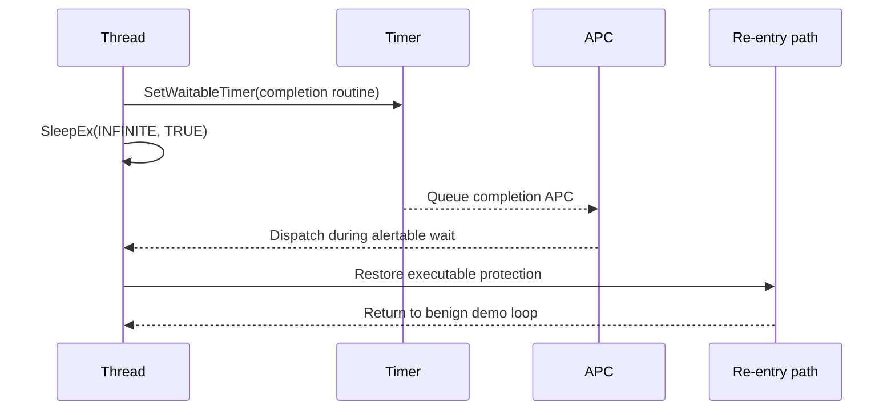

# Timer APC And SleepEx

The most important semantic fix in the refresh is the move to
`SleepEx(INFINITE, TRUE)` for timer/APC re-entry waits.

## Corrected Model

The second benign MessageBox now depends on APC dispatch during an alertable
sleep. That is stronger evidence than simply observing that a waitable timer
object became signaled.

## Weak Mental Model

That shape can make a demo look successful even when the APC did not execute.
The repository documents the weakness because finding and fixing it is part of
the research value.

## Architecture Impact

- x86 preserves the original ROP/trampoline story but uses an alertable sleep for
  re-entry evidence.
- x64 uses a separate re-entry PIC that enters `SleepEx`.
- ARM64 and ARM64EC use re-entry assembly that also calls `SleepEx`.

See [Validation Overview](../validation/overview.md) for what this proves and
[Responsible Use](../responsible-use.md) for scope limits.
