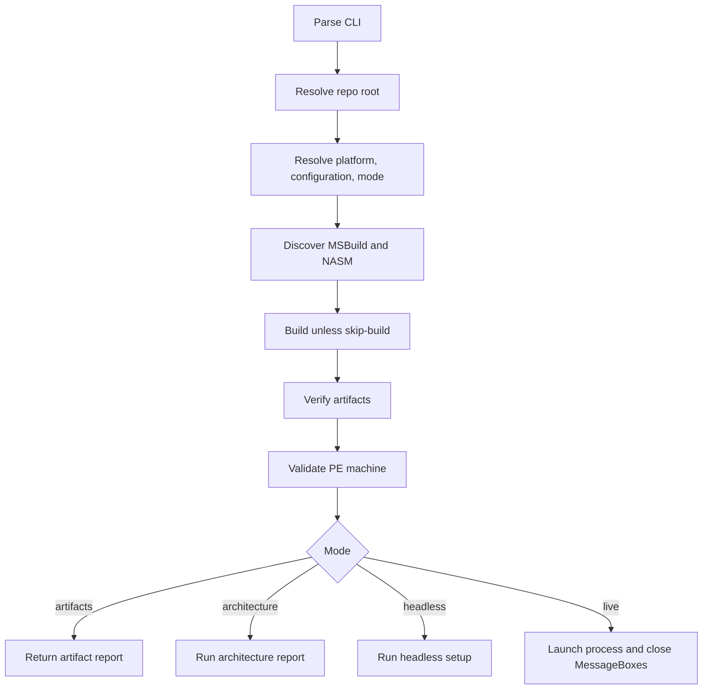

# Acceptance Harness

The Python acceptance harness is the main reproducibility layer. It builds the
requested platform, verifies artifacts, validates PE machine identity, and then
runs the selected acceptance mode.

## CLI Model

```powershell
uv run --all-groups gargoyle-acceptance --configuration Debug --platform x86 --mode live
```

Supported configurations are `Debug` and `Release`. Supported platforms are
`x86`, `x64`, `arm64`, and `arm64ec`. Supported modes are `live`,
`artifacts`, `architecture`, and `headless`.

## Flow



## Important Modules

- `environment.py`: toolchain, platform, configuration, and artifact discovery.
- `build.py`: MSBuild command construction.
- `harness.py`: high-level run orchestration.
- `architecture.py`: architecture-report parsing.
- `pe.py`: PE machine validation.
- `windows.py`: MessageBox window discovery and closing.

The generated [Python API](../api.md) documents public module surfaces.
