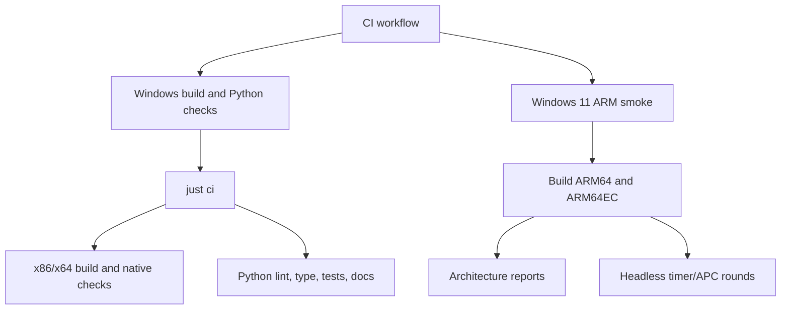

# Tests And CI

The test system checks Python behavior, documentation, native builds, and hosted
Windows-on-Arm smoke evidence.

## Local Checks

```powershell
just check
just ci
```

`just check` runs formatting, linting, pydoclint, mypy, pytest with coverage, and
MkDocs strict build. Coverage must remain at or above the threshold configured in
`pyproject.toml`.

`just ci` adds dependency sync, lock checking, x86/x64 builds, MSVC code
analysis, and AddressSanitizer builds.

## CI Flow



## CI Limitations

CI-safe checks do not replace live desktop MessageBox validation. The ARM job
runs short benign headless processes and architecture probes; it avoids GUI
automation.

See [Validation Overview](../validation/overview.md) for claim language.
